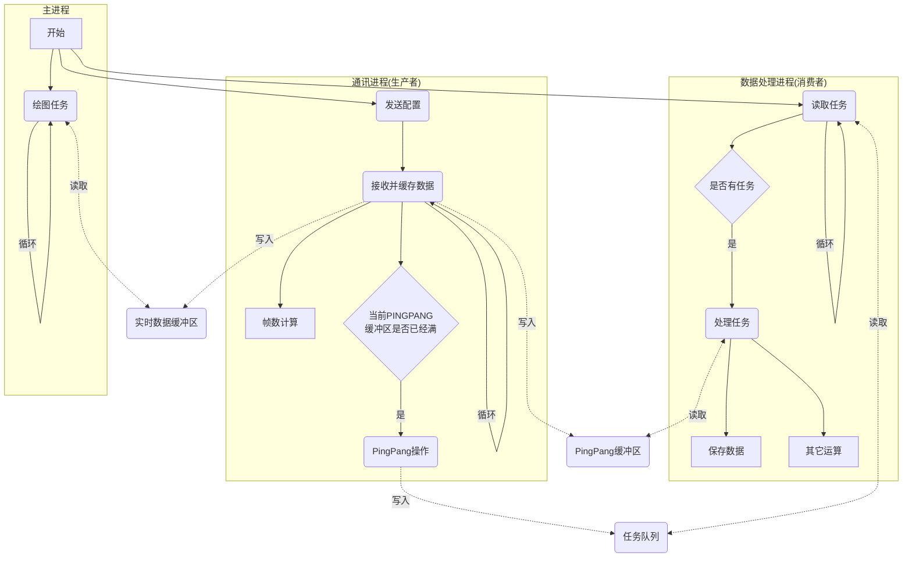
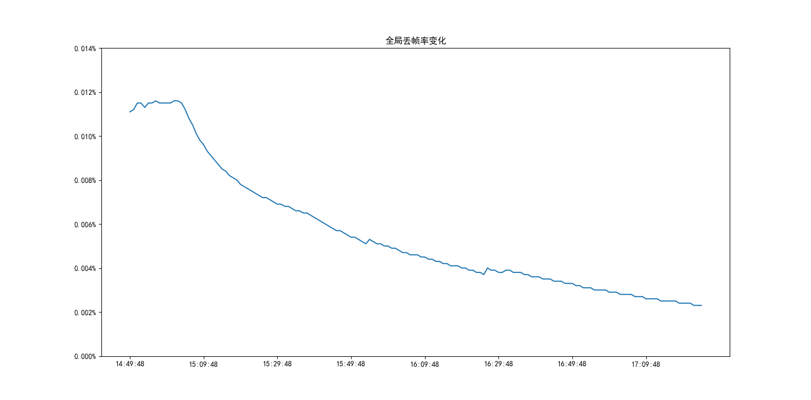
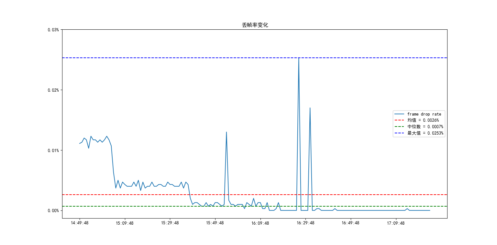
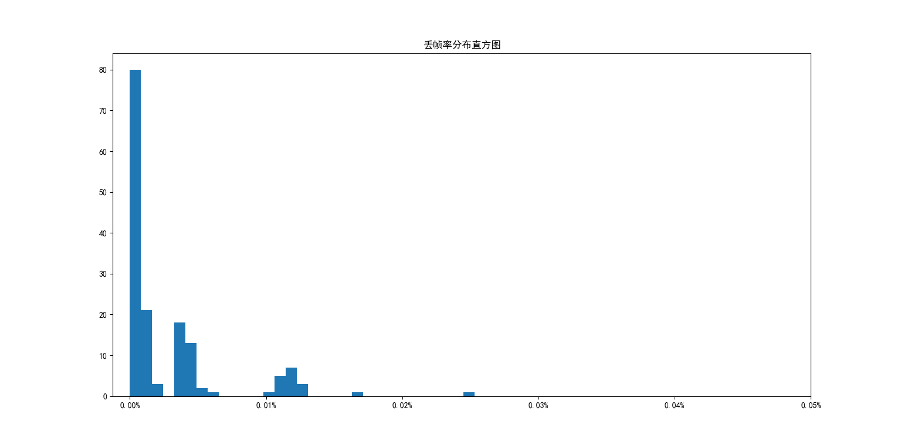

# DAS读取脚本测试报告
## 脚本执行流程图

## 测试结果
### 基本信息
数据点数：1999
采样率：5000Hz
测试时间：2024-05-31 17:27:27 - 2024-06-01 16:14:29
文件保存范围：2024-06-03 14:50:00 - 2024-06-03 17:00:00
文件保存间隔：1s
额外计算负载：对全点位进行以1s为窗口的FFT计算

### 系统信息
系统：Windows 10专业版x64
处理器：12th Gen Intel(R) Core(TM) i7-12700K @ 3.61GHz, 12核, 20线程
内存：金士顿 32GB(16GBx2) DDR5 4800MHz
硬盘：WDC WD40NPZZ-00A9JT0 4TB 5400转 USB3.0 SATA3.0 (实测读写大约在40MB/s，写入略低于40)
网口：千兆

### 文件丢失情况
理论文件数：7801
实际文件数：7801
时间偏移：0.222s
丢包率：0.222/(7801 + 0.222) = 0.002846%
> 文件保存时可能会产生一定的写入时延（例如，16:00:00的数据实际文件创建或写入时间为16:00:11），单文件大小越大越容易产生时延，且时延也越高。当文件大小大于100MB时时延会稳定出现，并随着时间推移而累计增加。而时延在一定范围内并不会导致丢包，但并未测试具体的阈值。
> 时延的产生是由于Python的文件IO中file.flush()并不保证数据立即写入磁盘，而是将数据从用户空间缓冲区写入内核空间缓冲区，而尤其是磁盘读写速度较慢时，会导致缓存区数据堆积，从而导致时延。而在缓存占满之前并不会导致程序的多余阻塞，因此不会导致丢包。
> 当前磁盘在17h的长时间保存测试中，以1s作为存储单位（20MB），发现时延累积到了20s左右，而时延有时候会增加有时会减小，这可能是由于机械硬盘的读写速度不稳定导致的，但总体来说时延是大致在增加的。因此，**当前文件存储负载下，目前的硬盘读写速度是不够的**。

### 数据帧丢失情况
全局丢帧率: 0.0023%
全局丢帧率随时间变化：

短时丢帧率随时间变化：

短时丢帧率分布直方图：

> 全局丢帧率为从开始接收数据到结束接收为止的整个时间段内的丢帧率。
> 文件丢包率约等于接收文件期间的丢帧率。
> 图表中的平均丢帧率为根据每段时间内的丢帧率求平均得出的和全局丢帧率会有一定差异。
> 绝大部分时间丢帧率都小于0.01%，且丢帧率随时间变化不大。此外，DAS系统本身的时钟速度也有一定误差，实际帧数和通过采样率计算得到的理论帧数有一定差异，因此丢帧率的计算也有一定误差。但**总体来说，丢帧率可以满足数据采集的需求**。